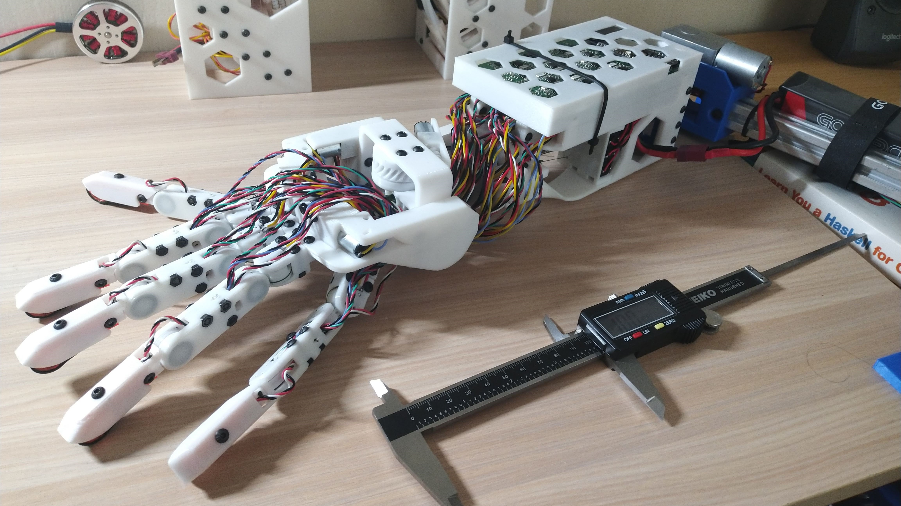

Hextech Mechahand
=================

Full range of motion robotic hand with pressure, position and force sensors for $300 bill of materials.

  
  

The Hextech mechahand is designed to be a low cost robot hand with a similar range
of motion as a human hand. It's targeted as an accessible standard for reinforcement
learning research. It has 20 degrees of freedom with position and force feedback on
each joint. The position encoders are placed in-situ allowing for accurate sensing
of the hand state regardless of the stretch on the tendons. Additionally there are
6 pressure sensors in the finger tips and palm for finer feedback. All electronics
plug into a compact PCB with current sensing for each actuated joint. The hand can
be controlled remotely by wifi using a force-limited PID loop. In the video, it's
mimicking my hand position in order to grasp an object. For autonomous control, a
custom force aware loop can be implemented.

The hand is built using off the shelf components and a 3D printed body at an amortized
cost of 300 USD per hand, requiring 30 hours of assembly time. Included in the cost
is the custom PCB designed for automated assembly. All design files for the mechanism,
the control circuit, and driver code is open source. Please open an issue wherever
[build instructions](build-instructions.md) need to be clarified.

Project layout
--------------

The project contains code for a 24 channel driver, the 3D printable model of the hand, and code to control the hand with a leap sensors. Details in the readme file of each folder.

* 24driver: Code and circuit design for a 24 channel PID controller. With wireless interface and also 12 pressure sensor inputs.
* hand_model: 3D model and instructions for the mecha-hand versions.
* leap_control: Code to control the hand via the leap motion sensor.

