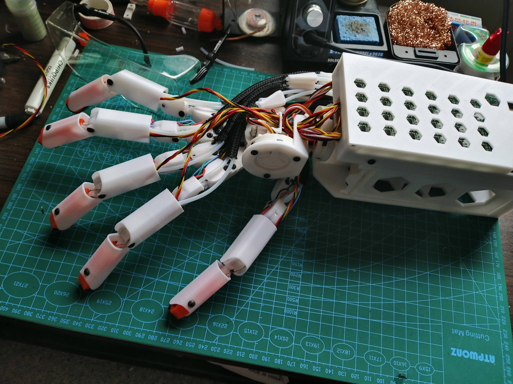

Hextech Mechahand
=================

20 degree of freedom mechanical hand. It is designed to have a similar range of
motion as a human hand and be built at low cost. The project is mostly 3D printed,
with the rest of the components being off-the shelf, cheap DC motors, bearings and
potentiometers. The logic is driven by a custom 24 channel servo driver, with design
files included and ready for machine assembly of the SMD components.

Project layout
--------------

The project contains code for a 24 channel driver, the 3D printable model of the hand, and code to control the hand with a leap sensors. Details in the readme file of each folder.

* 24driver: Code and circuit design for a 24 channel PID controller. With wireless interface and also 12 pressure sensor inputs.
* hand_model: 3D model and instructions for the mecha-hand versions.
* leap_control: Code to control the hand via the leap motion sensor.
* unused_libs: Buttons and encoder libs I didn't end up using, will be deleted when I find a better home for them.
